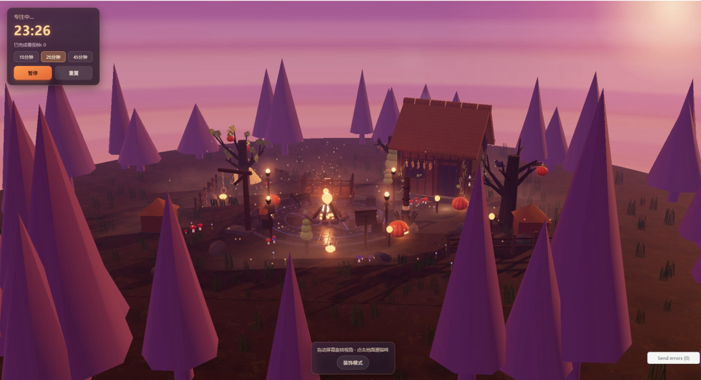

# 篝火与猫 Campfire & Cat

**《篝火与猫》**是一款在浏览器中运行的**治愈系微缩景观番茄钟**游戏。玩家在一片被夜色与月光笼罩的奇幻小场景中，陪伴一只会走会跑的黑猫，一起度过专注的番茄钟时光——没有关卡、没有失败、没有资源压力，只有篝火的暖光、风声与轻音乐，以及一点点可以自由摆弄的小小家园。

在线体验：将本仓库部署到 GitHub Pages 后即可直接在浏览器中打开游玩（纯前端，无需安装、无需服务器）。



---

## 游戏特色

《篝火与猫》的核心特色在于**把「专注计时」和「治愈系微缩景观」结合起来**，去掉了传统建造游戏和效率工具的压力感，让专注本身成为一件让人放松的事。

- **番茄钟陪伴机制**：提供 15 / 25 / 45 分钟三档预设时长，专注、小憩、长休息自动流转，完成一段专注后小猫会「喵~」一声轻轻提醒你，不刺耳、不打扰。
- **舒缓的环境声景**：篝火的噼啪声、若有若无的风声、五声音阶随机生成的舒缓纯音乐，全部通过 Web Audio API 实时合成，无需加载任何外部音频文件；整体音量经过克制处理，不会喧宾夺主，可一键静音/开启。
- **黑猫陪伴与加成**：点击地面即可遛猫，猫咪会自动寻路、切换待机/行走/奔跑动作。靠近炼金坩埚或中央篝火时会触发「专注 +50%」「温暖 +30%」的加成特效文字，鼓励玩家看着小猫在场景里悠闲地散步。
- **自由装饰、随心布置**：解锁装饰模式后可摆放灯笼、南瓜灯、小树、大树、蘑菇丛、长椅、小屋等多种家具，不限数量、不消耗资源；新增「删除装饰」按钮，可随时点选已放置的物品将其移除，方便反复调整自己的小家园。摆放/删除都配有轻柔的音效反馈。
- **随专注成长的家园**：可摆放的建造半径会随着完成的番茄钟数量逐步扩大，专注越多，能装饰的地盘也越大。
- **氛围感的美术呈现**：基于 Three.js 搭建的夜空、雾效、月光与泛光（Bloom）后处理，营造出安静、梦幻的奇幻小世界氛围。

## 游戏玩法

玩家的主要操作非常简单：

1. **开始专注**：在左上角计时面板选择时长（15/25/45 分钟），点击「开始专注」进入番茄钟工作状态；拖动屏幕即可旋转视角观察场景。
2. **陪伴小猫**：点击地面上任意位置，黑猫会自动走/跑过去；靠近场景中的篝火与坩埚会自动获得专注加成，猫咪走得越勤，加成也越持续。
3. **装饰家园**：点击底部「装饰模式」展开家具列表，选择一种家具后点击空地即可放置（按 R 键可旋转朝向）；点击「删除装饰」再点选已放置的物品即可将其移除，方便反复调整布局。
4. **专注流程**：一段专注结束后会自动进入小憩或长休息，累计 4 次专注后进入长休息，猫咪的一声喵叫提示当前阶段结束；也可随时暂停或重置计时器。
5. **环境音开关**：右下角的音量按钮可随时开启/关闭篝火、风声与背景音乐等环境音效。

## 开发过程

《篝火与猫》最初的原型基于 Godot 引擎搭建（女巫试炼 / Witch Idle 项目），核心的计时器状态机、加成逻辑与家具建造系统均在 Godot 版本中完成设计。后续为了方便在浏览器中直接分享与体验，项目被重新用 **Three.js + 原生 JavaScript** 实现为纯前端网页版本，保留了原有的玩法结构（GameManager 状态机、SceneBuilder 家具建造、FloatingText 冒字特效等），并将其一一对应地移植为浏览器端模块。

技术要点：

- **渲染**：Three.js 搭建场景，使用 `EffectComposer` + `UnrealBloomPass` 实现柔和的泛光效果，配合 `ACESFilmicToneMapping` 与夜空、雾效营造氛围。
- **角色动画**：黑猫模型使用 glTF（rig / idle / walk / run 动画）驱动，运行时通过脚部骨骼动态贴地，消除走跑动画与地面的穿模/跳动问题。
- **音频**：不依赖任何外部音频文件，篝火、风声、纯音乐、喵叫、点击/放置/删除音效均通过 Web Audio API 用振荡器与噪声实时合成，并统一做了音量克制处理。
- **状态与存档**：番茄钟状态机、专注积分、已放置的家具列表均通过 `localStorage` 持久化，刷新页面后进度不会丢失。
- **纯前端、零依赖**：整个游戏是单个 `index.html`，仅通过 CDN 引入 Three.js 及其扩展模块，没有任何构建步骤，克隆仓库后即可直接打开或部署到静态托管服务。

## 本地运行

由于页面使用了 ES Module（`type="module"`），建议通过本地静态服务器打开，而不是直接双击 `index.html`：

```bash
# 任选一种方式启动本地服务器
python -m http.server 5500
# 或
npx serve -p 5500
```

然后在浏览器中访问 `http://localhost:5500/index.html` 即可开始游玩。

## 部署到 GitHub Pages

1. 将本仓库推送到 GitHub。
2. 在仓库 Settings → Pages 中，选择 `main` 分支的根目录作为发布源。
3. 保存后即可通过 `https://<你的用户名>.github.io/<仓库名>/` 在线体验。

---

素材说明：猫咪骨骼动画模型来自第三方资源包，其余场景模型（灯笼、南瓜灯、树木、蘑菇、长椅、小屋、篝火、坩埚等）均由代码程序化生成，未使用任何额外的美术素材文件。
